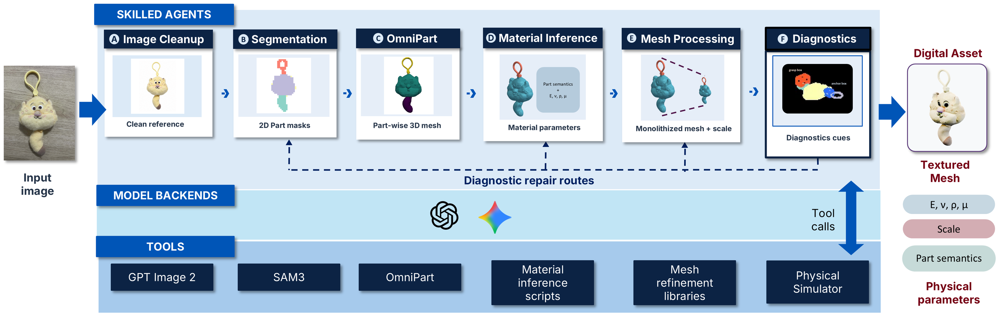

# DiagGen

### Agentic Generation of Deformable Assets with Sim-based Diagnostics for Robotic Simulation

<p align="center">
  
  
  
  
</p>

DiagGen turns a single object image into a simulation-ready deformable asset.
Skill-driven agents clean the image, segment its parts, generate part-wise geometry,
infer material properties, and build a volumetric mesh. Genesis diagnostics probe
the candidate in simulation and can route repair cues to earlier stages before
texture generation and final export.



*Figure 1. DiagGen architecture. Skilled agents coordinate model backends and
deterministic tools; simulator-based diagnostics can send a candidate back for
targeted repair before export.*

The entry skill is `.agents/skills/run-diaggen-pipeline/SKILL.md`. It delegates
stages to agent children; Python tools initialize state, perform deterministic
operations, and communicate with the external simulator. The `hag4r` Python
namespace and wire-format identifiers are retained for dependency compatibility.

## Setup

Dependencies and external integration requirements are listed only in
`requirements.txt`. External model packages, checkpoints, environments, and
simulator source are not bundled. Configure the external simulator checkout
and environment in `configs/config_genesis_diagnostics_enabled.yaml`; relative
paths there are resolved from the `configs/` directory. The Genesis badge shows
the version of the companion simulator source used for this project; the
checkout must also provide the live diagnostics API.

The runtime uses the existing environment names `hag4r`, `hag4r_mesh`,
`hag4r_segmentation`, and `omnipart`, preferring matching prefixes under `.conda/`.
Use a configured environment to install the runtime requirements:

```bash
conda run -p ./.conda/hag4r python -m pip install -r requirements.txt
```

For the diagnostics MCP server, set `DIAGGEN_ROOT` to this checkout before
opening the agent application. `.codex/config.toml` supplies the server launch
configuration. It contains no account credentials.

## Initialize one asset

Place a raw input image at `outputs/inputs/object.png`, then run from this root:

```bash
conda run -p ./.conda/hag4r python -m hag4r.agentic.run_diaggen_pipeline \
  --source_image outputs/inputs/object.png \
  --run_id object_example \
  --run_root outputs/agentic_asset_refinement \
  --config configs/config_genesis_diagnostics_enabled.yaml
```

This initializes the ledger; continue through the pipeline skill to execute
stages. Generated artifacts belong under `outputs/`.

Runtime logs, input images, and generated artifacts should be reviewed
separately before including them in a submission.
